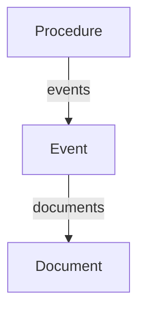
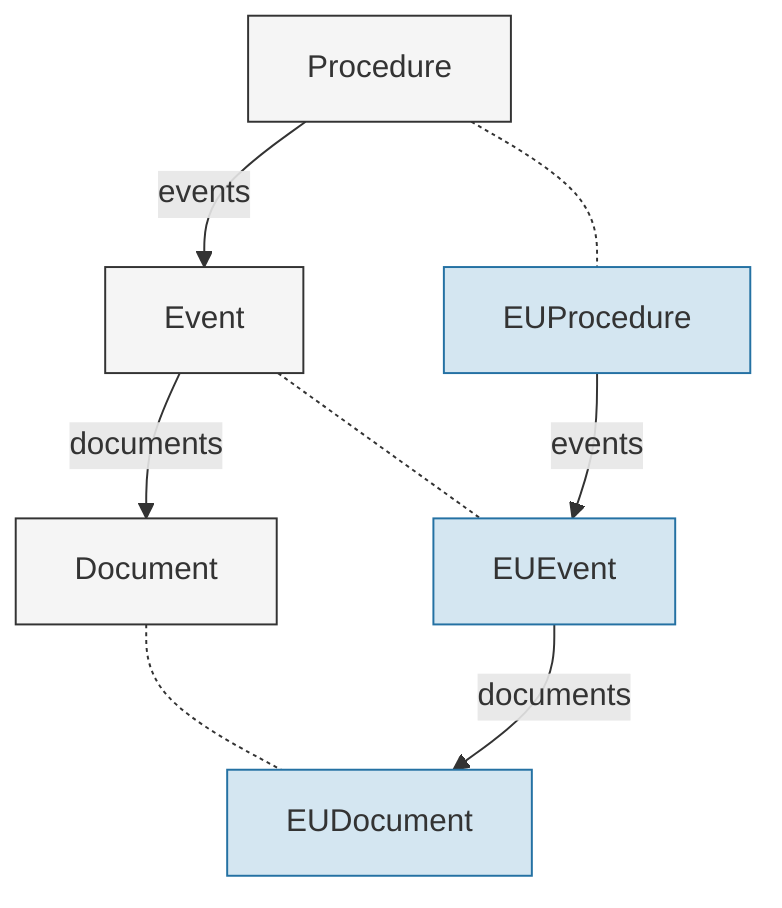

# Model Guide

openstage models are typed Pydantic models for legislative data. They define a nesting hierarchy (Procedure > Event > Document) with core properties shared across all legislative systems. Case-specific models (like the EU models) inherit these base models and add additional properties that capture domain knowledge particular to that system, such as procedure types, legislative phases, or institutional actors.

## The nesting structure



**Procedure** is the top-level container representing a legislative process. **Events** represent steps in that process (a proposal, a committee vote, a final adoption). **Documents** live under events because they are meaningful in the context of specific procedural stages: a proposal comes from a Commission event, the final act from an adoption event, amendments from committee events.

Use `get_all_documents()` to collect all documents across all events into a flat list.

```python
proc.events[0].documents        # Documents from the first event
all_docs = proc.get_all_documents()  # All documents across all events
```

Every entity also carries:

- `identifiers: Identifiers` for multi-scheme ID lookup
- `_raw: dict` for source metadata (excluded from serialization)
- `extra="allow"` so domain-specific attributes are accessible directly on the instance

## Base models vs. case models

The base models define core properties that apply to any legislative system: a procedure has a title, identifiers, and a list of events; an event has a date, type, and documents; a document has a title and date. Case models inherit all of this and add properties specific to their domain. For example, `EUProcedure` adds `procedure_type`, `subject_matters`, and `basis_legal`, while `EUEvent` adds `initiated_by_institution` and `occurs_in_phase`.



<span style="display:inline-block;width:12px;height:12px;background:#f5f5f5;border:1px solid #333;vertical-align:middle"></span> Base model &nbsp;&nbsp; <span style="display:inline-block;width:12px;height:12px;background:#d4e6f1;border:1px solid #2471a3;vertical-align:middle"></span> Case-specific EU model

Case models re-declare the `events` and `documents` type annotations so Pydantic validates nested entities as the case-specific type. Inherited fields (title, date, type) do not need to be re-declared.

See [EU Models](eu-models.md) for the full EU case API reference.

## Core primitives

### MultiLangText

A dict-like container mapping language codes to text strings. First-class primitive throughout the model hierarchy.

```python
from openstage.models import MultiLangText

title = MultiLangText({"en": "Regulation on ...", "fr": "Reglement sur ..."})
title["en"]                     # "Regulation on ..."
title.languages                 # ["en", "fr"]

# preferred() fallback chain: en > fr > de > _ > first available
title.preferred()               # "Regulation on ..."

# Plain string assignment auto-validates
proc.title = "plain text"       # becomes MultiLangText({"_": "plain text"})

# Flexible construction from mixed inputs
MultiLangText.from_value({"en": "text"})    # dict -> MultiLangText
MultiLangText.from_value("text")            # str -> MultiLangText({"_": "text"})
MultiLangText.from_value(None)              # None -> None
```

The `"_"` key represents untagged text (no language information available). `preferred()` checks `"_"` after the named languages but before falling back to the first available value.

### Identifiers

Legislative entities carry identifiers from multiple naming systems. The `Identifiers` collection provides scheme-based lookup.

```python
proc.identifiers.get("celex")               # Single value or None
proc.identifiers.get_all("eli")             # All values for a scheme (list)
proc.identifiers.add("celex", "32016R0679") # Add a new identifier
proc.identifiers.schemes                    # ["celex", "cellar", "eli", ...]
```

Each `Identifier` is a frozen Pydantic model with `scheme` and `value` fields. In EU adapters, URI patterns determine the identifier scheme automatically (e.g., URIs containing `/celex/` map to the `"celex"` scheme).

### Source metadata (_raw)

The `_raw` private attribute stores source metadata that does not belong in the typed model. It is excluded from `model_dump()` and serialization.

```python
proc._raw["_rdf_types"]     # Original RDF type URIs
proc._raw["_same_as"]       # owl:sameAs alias URIs
proc._raw["_raw_triples"]   # Unconsumed RDF triples
```

## Researcher interface properties

`Procedure` defines properties that provide a consistent interface for researchers across different legislative systems:

| Property | Base default | Purpose |
|----------|-------------|---------|
| `start_event` | Earliest event by date | The event that initiated the procedure |
| `start_date` | Date of `start_event` | When the procedure started |
| `adoption_event` | `None` | The event where the text was formally adopted |
| `adoption_date` | Date of `adoption_event` | When the text was adopted |
| `end_event` | Same as `adoption_event` | The terminal event that concluded the procedure |
| `end_date` | Date of `end_event` | When the procedure concluded |
| `status` | `"adopted"` if adoption event exists, `"ongoing"` if events exist, `None` if empty | Current status of the procedure |

| Method | Signature | Purpose |
|--------|-----------|---------|
| `duration()` | `duration(reference_date: str \| None = None) -> int \| None` | Days between `start_date` and `end_date`. For ongoing procedures, uses `reference_date` (defaults to today). Returns `None` if no start date. |

These are designed to be overridden by case models with domain-specific logic. The base defaults use chronological heuristics where possible and return `None` where domain knowledge is required.

When you subclass `Procedure`, a warning is emitted at class definition time if you do not override `adoption_event`, `end_event`, and `status`, since these almost always require domain-specific logic.

## Building custom case models

### Extending the hierarchy

To model a specific legislative system, subclass `Procedure`, `Event`, and `Document`. Add case-specific properties as typed fields, and override the `events`/`documents` type annotations so Pydantic validates nested entities as your custom types:

```python
from openstage.models.procedure import Procedure
from openstage.models.event import Event
from openstage.models.document import Document


class MyDocument(Document):
    doc_number: str | None = None


class MyEvent(Event):
    documents: list[MyDocument] = []        # Override type annotation
    phase: str | None = None
    responsible_body: str | None = None     # Case-specific property


class MyProcedure(Procedure):
    events: list[MyEvent] = []              # Override type annotation
    procedure_type: str | None = None       # Case-specific property
    subject_areas: list[str] = []           # Case-specific property
```

These case-specific properties are regular Pydantic fields. They can use plain defaults as above, or the [field metadata system](fields-codebook.md) for richer annotations (controlled vocabularies, data source provenance, variable types) that power codebook generation.

### Implementing interface overrides

Case models should override the researcher interface properties with domain-specific logic:

```python
class MyProcedure(Procedure):
    @property
    def start_event(self) -> Event | None:
        """Find the proposal event."""
        for event in self.events:
            if event.type == "PROPOSAL":
                return event
        return super().start_event          # Chronological fallback

    @property
    def adoption_event(self) -> Event | None:
        """Find the formal adoption event."""
        for event in self.events:
            if event.type == "ADOPTION":
                return event
        return None

    @property
    def end_event(self) -> Event | None:
        """Terminal event: adoption or withdrawal."""
        event = self.adoption_event
        if event is not None:
            return event
        for event in self.events:
            if event.type == "WITHDRAWAL":
                return event
        return None

    @property
    def status(self) -> str | None:
        """Derive status from event types."""
        if self.adoption_event is not None:
            return "adopted"
        for event in self.events:
            if event.type == "WITHDRAWAL":
                return "withdrawn"
        return "ongoing" if self.events else None
```

Call `super().start_event` to fall back to the base chronological heuristic when no domain-specific start event is found. For `adoption_event`, `end_event`, and `status`, the base defaults are rarely useful, so override them directly.

### The from_openbasement pattern

EU case models use a `from_openbasement` classmethod to map external dicts to typed models. This pattern is modular: `EUProcedure.from_openbasement` calls `EUEvent.from_openbasement`, which calls `EUDocument.from_openbasement`.

```python
@classmethod
def from_openbasement(cls, data: dict) -> MyProcedure:
    events = [MyEvent.from_openbasement(e) for e in data.get("events", [])]
    proc = cls(
        identifiers=build_identifiers(data),
        title=MultiLangText.from_value(data.get("title")),
        events=events,
    )
    proc._raw = extract_raw_metadata(data)
    return proc
```

This allows sideloading document metadata from separate sources and keeps the mapping logic close to the models it produces.

## EU case: a worked example

`EUProcedure` is the concrete implementation for EU legislative data. Here is how it uses the patterns described above.

```python
from openstage.models.eu import EUProcedure

proc = EUProcedure.from_openbasement(data)

proc.title["en"]                    # Multilingual title
proc.identifiers.get("celex")       # CELEX identifier
proc.procedure_type                 # "OLP", "CNS", etc.
proc.start_date                     # Date of Commission proposal
proc.adoption_date                  # Date of formal adoption (or None)
proc.status                         # "adopted", "withdrawn", or "ongoing"
proc.get_all_documents()            # All documents across all events
```

EU-specific start, adoption, withdrawal, and status logic matches on known event type codes (e.g., `ADP_byCOM` for Commission proposals, `ADP_FRM_byCONSIL` for Council adoption, `WDW_byCOM` for withdrawal). The `end_event` property returns the adoption event if present, otherwise the withdrawal event. See [EU Models](eu-models.md) for the full API reference and field details.
